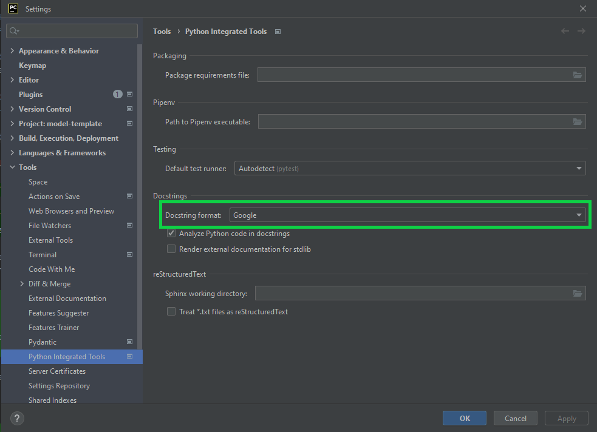

.. _setup-instructions:

Setup Instructions
==================

There are some additional instructions in `this OneNote <https://ethreesf.sharepoint.com/sites/Training/_layouts/15/Doc.aspx?sourcedoc={8e5fb17b-013c-4eb4-9b4e-e868e3530c5e}&action=edit&wd=target%28Technical%20Skills%20Training%2FPython.one%7C916c3a04-a4b3-4112-9e7f-f2f503e5b87c%2FDocumentation%20%20Docstrings%7C72764774-57ee-4bc6-8496-e63524712ff6%2F%29&wdorigin=NavigationUrl>`_
if you would prefer to start from scratch, but you should be able to shortcut this with the instructions below.

**Warning!** Make sure you use Google-style docstrings in your code. You can configure Pycharm to automatically use this
format by going to Settings > Tools > Python Integrated Tools > Docstrings > Docstring format (see below).

Package Documentation
---------------------

To automatically document all modules in your model package:

Required: Before you begin, make sure you have the `following packages <https://github.com/e3-/model-template/blob/03c976121139bb24d78c30748200153067d8c0f0/pyproject.toml#L35>`_ added to your dev environment:
  * ``sphinx``
  * ``sphinx-copybutton``
  * ``sphinx-design``

1. [if adding to an existing repo] Copy all files from `the docs folder <https://github.com/e3-/model-template/tree/main/docs>`_ into your repo.

2. Delete the following files from ``docs/source/``

  * ``modules.rst``
  * ``src.rst``
  * ``src.ui.rst``
  * ``src.visualization.rst``

3. Navigate to the ``docs/`` folder in your shell, activate the environment, and run the following. Keep in mind that the specified path should be
to the root folder of your *package,* not of your *repository*::

    sphinx-apidoc -f -o source absolute/path/to/your-model-package-folder

    # For example
    # sphinx-apidoc -f -o source C:\Users\john.smith\my_models\new-modeling-toolkit\new_modeling_toolkit

4. You should now see several new .rst files in the ``docs/source/`` folder. If you'd like, you can open these files
and manually add any additional documentation you think would be useful.

5. In your shell, run the following from within the ``docs/`` folder::

    ./make html

    # On a Mac, the command is simply `make html`

    # If you are using LaTeX to generate math expressions in your docstrings, also run:
    ./make latex

6. Navigate to ``docs/build/html/`` and open ``index.html`` to view your documentation!

7. Note that in the future, if you change the structure of your package, you will need to re-run these instructions to
   ensure your documentation follows the new structure and to add any new submodules to the documentation.

Hosting Documentation on ReadTheDocs
------------------------------------

The documentation for your repository can easily be hosted on the E3 Read the Docs website. Reach out to Roderick Go,
Emily Peterson, or Sam Kramer to have them enable a page for your model. Once this is done, the documentation will be
rebuilt automatically after every new commit to your ``main`` branch.

    * You will need to add the `.readthedocs.yaml <https://github.com/e3-/model-template/blob/main/.readthedocs.yaml>`_ file to your repository. If you are using the model-template, this file is already included.
    * If you have private repos as dependencies in your environment, you will need to update the .readthedocs.yaml file to match `this format <https://github.com/e3-/pathways/pull/7/files>`_
    * You will also need to add a `personal access token <https://docs.github.com/en/authentication/keeping-your-account-and-data-secure/managing-your-personal-access-tokens>`_ to the Read the Docs `environmental variables. <https://readthedocs.com/dashboard/e3-pathways/environmentvariables/>`_
    * Ensure you have these packages in your environment used by ReadTheDocs:
        - "autodoc_pydantic"
        - "furo"
        - "myst-parser"
        - "sphinx"
        - "sphinx-copybutton"
        - "sphinx-design"